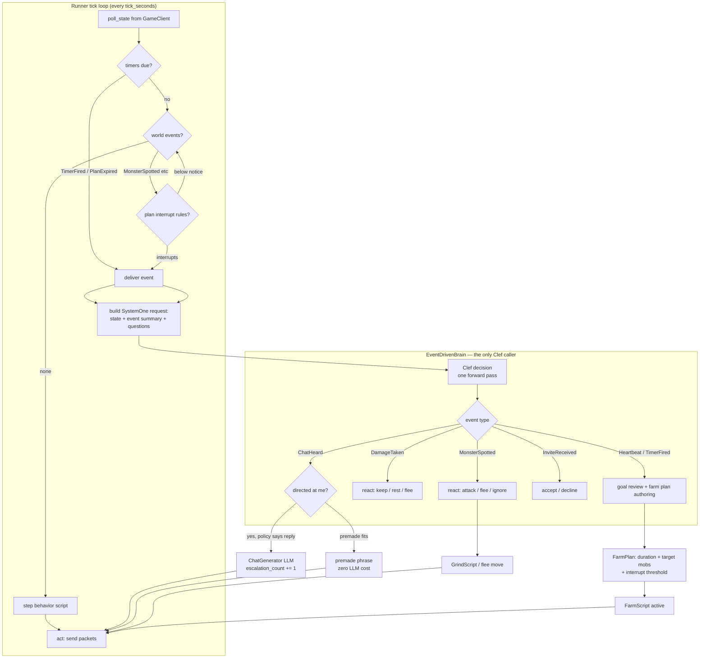

# Decision flow

Normative map of one bot's control loop. Code: `robots.app.runner`,
`robots.app.brain`, `robots.app.scripts`, `robots.app.timers`.

## Properties (enforced by tests)

- Clef is called **only** from `handle_event` — never per tick (ADR-001).
- Premade chat (`PREMADE_CHAT`) is emitted **without** the LLM; the LLM is
  only for free-form replies (ADR-000 escalation split).
- While a FarmPlan is active, monster events below the plan's threshold never
  reach the brain (ADR-003).
- All timing is random-range and injectable (ADR-002).

Related: [[adr-000-hexagonal-architecture]], [[adr-001-event-driven-brain]],
[[escalation-policy]]
